# \*\* Bruscani Racer Models \*\*
The official repository for the book, "How to 3D Print and Build Your Own RC Race Car".
 

<a href="https://www.amazon.com/dp/B0FLN7YXK4/ref=sr_1_1?crid=3FX28SM71M6UU&dib=eyJ2IjoiMSJ9.R7AYUbtp98nn9gJqvC8iOpwaHkhlDekMvi5zRaq-tTAR8JWRpjmkxLH28Cm6X2QISBX4lKaF3uNkrIGcnYcpRhz_hQUYTx891dbqSJwbgDPB6Vnzz8pCL2FwLhn8qhamWcCTuOMaovX2fT1thkpIuA.LBgexhxP_26t2Wjcsm5EbWE_tnvWr1-eNz9EOMwcxPU&dib_tag=se&keywords=how+to+3d+print+and+build+your+own&qid=1754671920&sprefix=how+to+3d+print+and+build+your+own%2Caps%2C82&sr=8-1" target="_blank">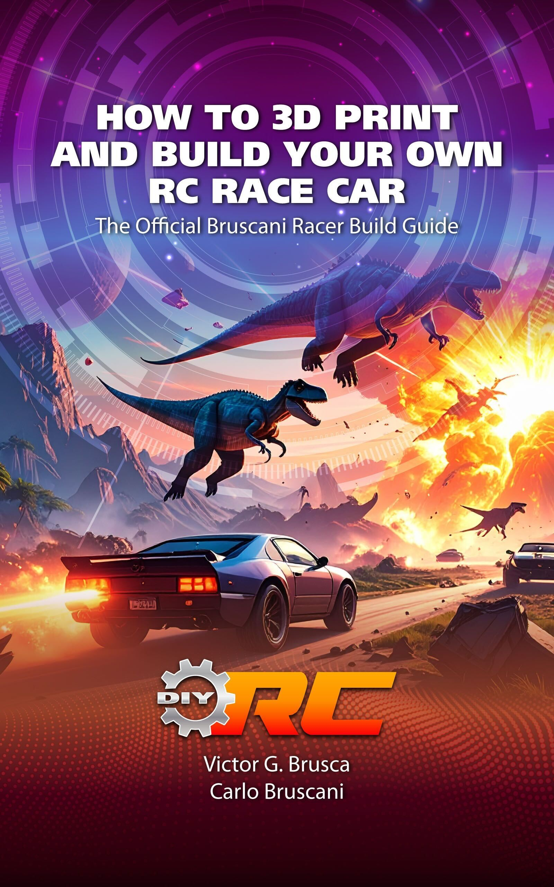</a>
 
by:
 
Victor G. Brusca
 
Carlo Bruscani

## Description
Master the art of building and customizing your own remote control race car — one part at a time.
This step-by-step guide is your complete blueprint to 3D printing, assembling, and powering the Bruscani Racer — a fast, customizable, and fully functional RC car built with off-the-shelf parts and a 3D-printed chassis you make yourself.

Whether you're a newcomer to RC cars or an experienced hobbyist, this book has something for you:
 
&nbsp;   • 📦 Beginners will be guided through the entire build process — from printing the chassis to wiring up the electronics — gaining the knowledge and confidence to become self-sufficient RC car builders.
 
&nbsp;   • 🔧 Veterans will appreciate the low-cost, highly customizable design. With the ability to reprint and rebuild the chassis at will, experimenting with motors, ESCs, servos, RX/TX units, tires, and filaments becomes easier than ever.
 

📘 What You'll Learn:
 
&nbsp;   • How to 3D print and assemble the Bruscani Racer chassis
 
&nbsp;   • How to install and wire up the powertrain, including motor, battery, ESC, receiver, and servo
 
&nbsp;   • How to source affordable, off-the-shelf RC parts
 
&nbsp;   • How to repair or rebuild your car anytime
 

This book is more than a build manual — it's a launchpad into the world of customizable RC racing. Once you build your first Bruscani Racer, you'll have the tools, skills, and freedom to create, iterate, and race on your own terms.
 

# Example Builds
Here are a few example builds demonstrating the flexibility of the car's design.

## The Mean Green
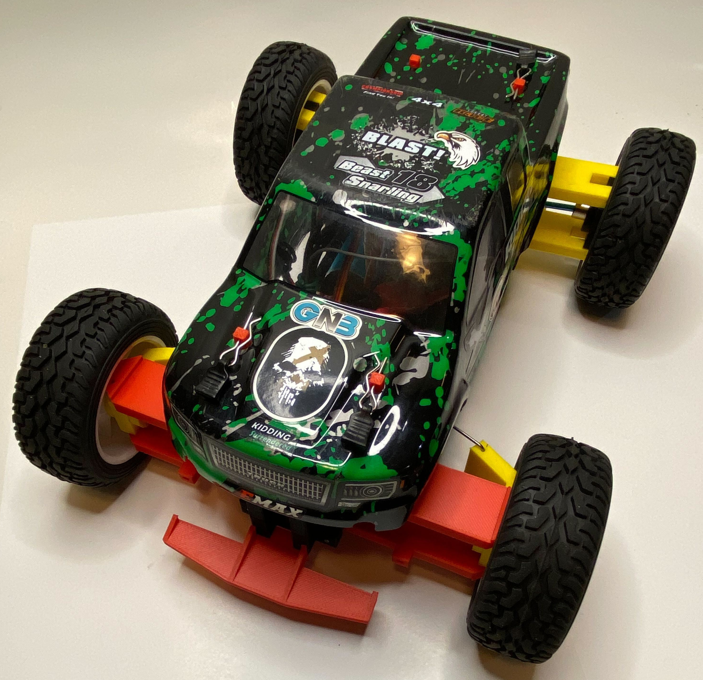
 

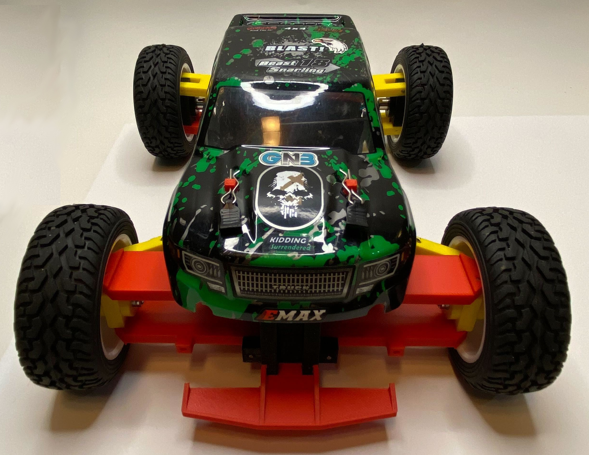
 

## The Acula
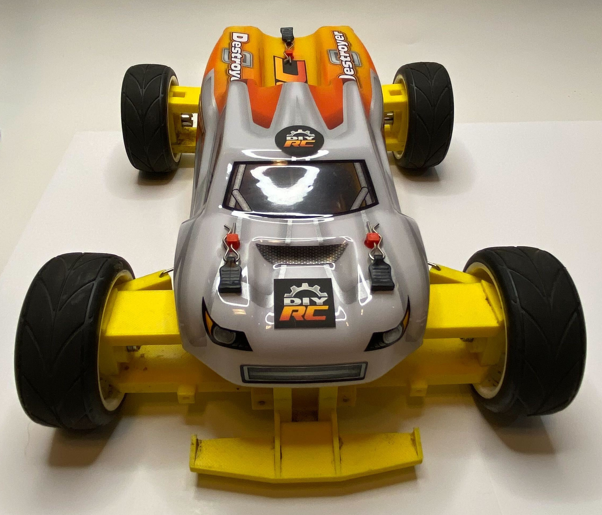
 

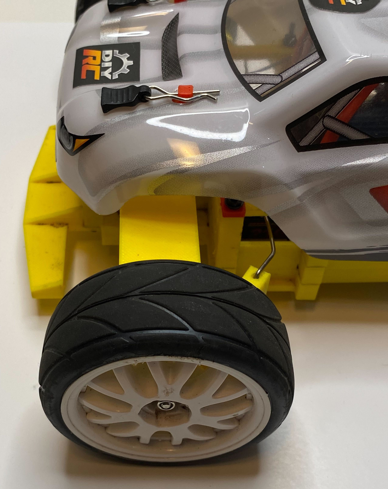
 

## The Cammo Truggy
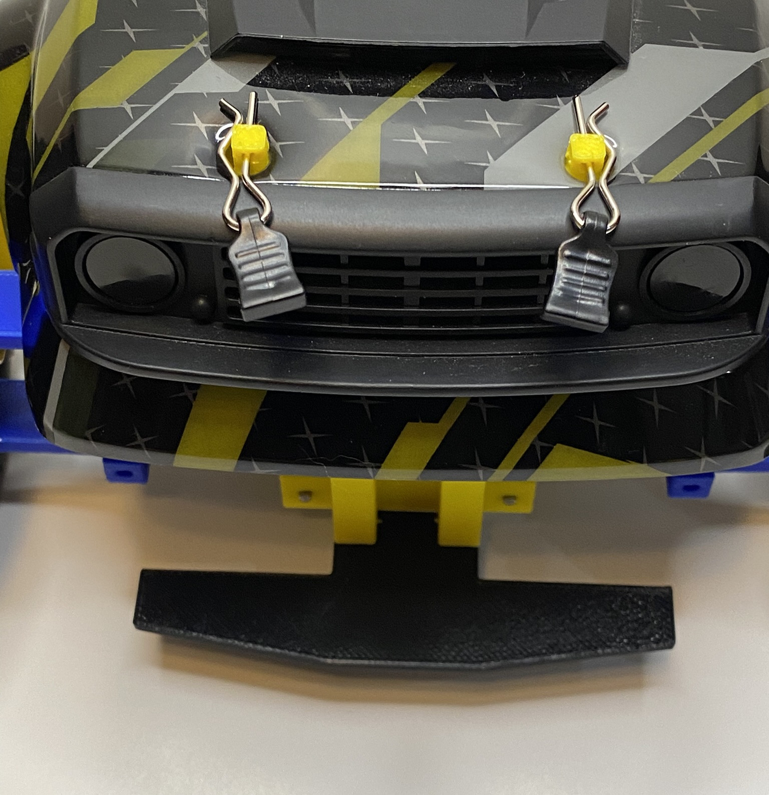
 

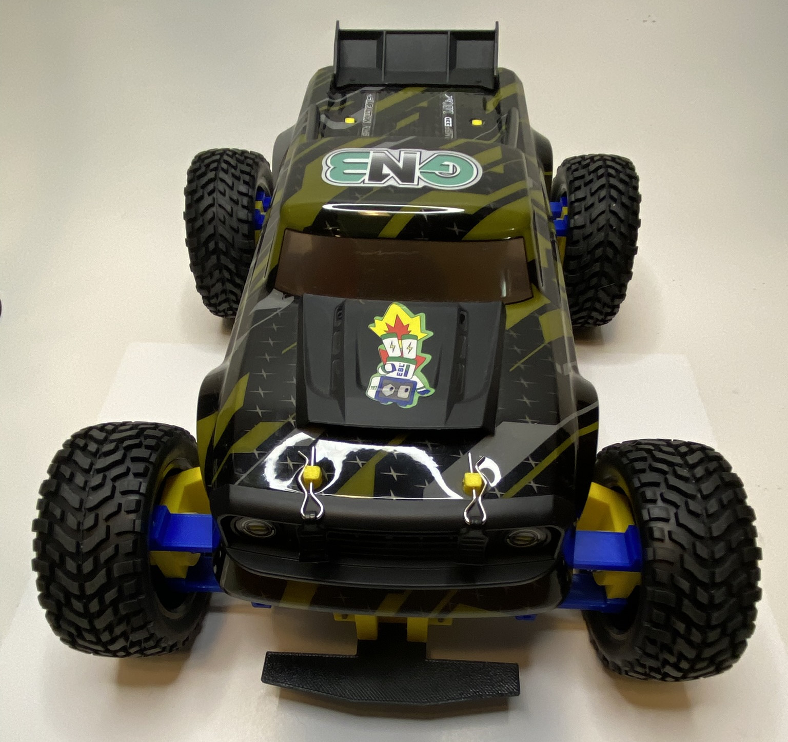
 

## Internals and Errata
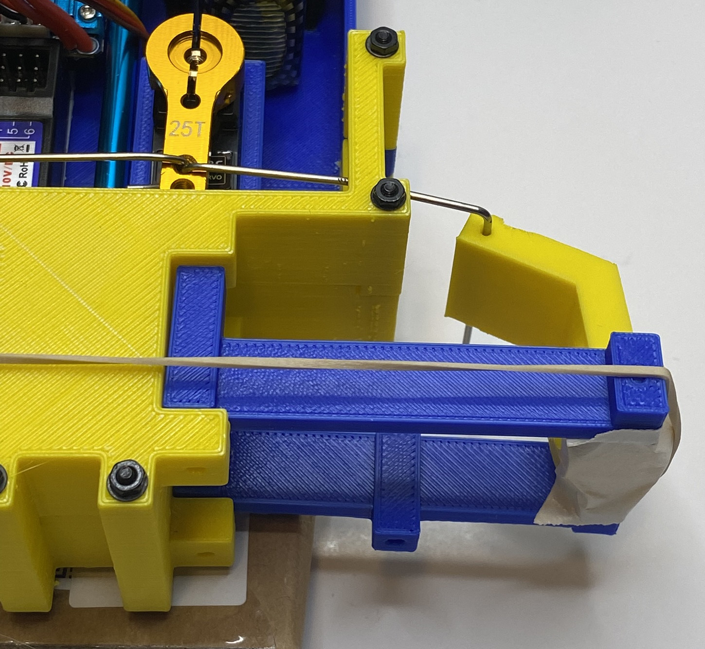
 

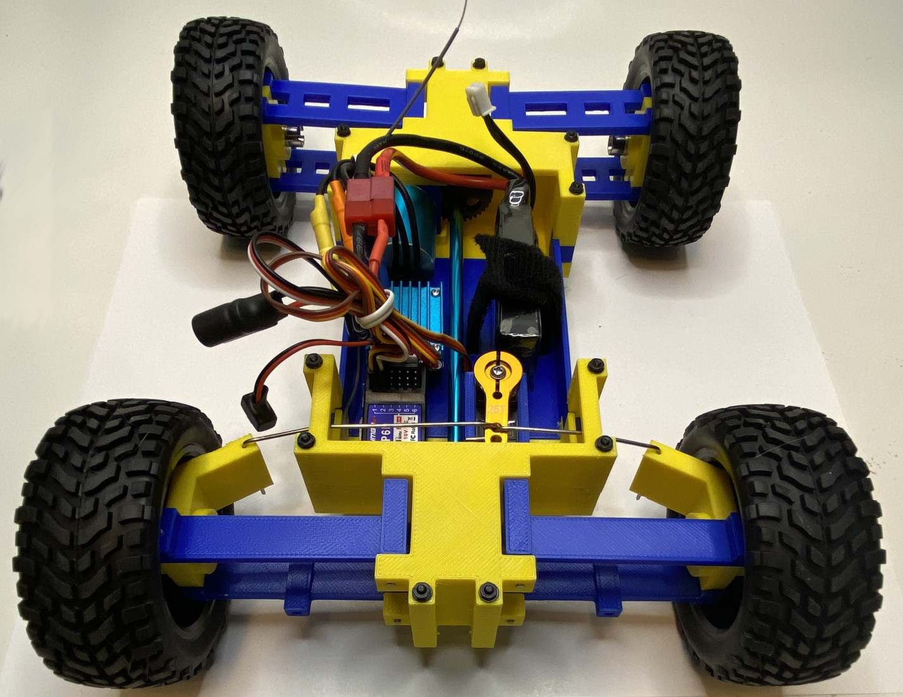
 

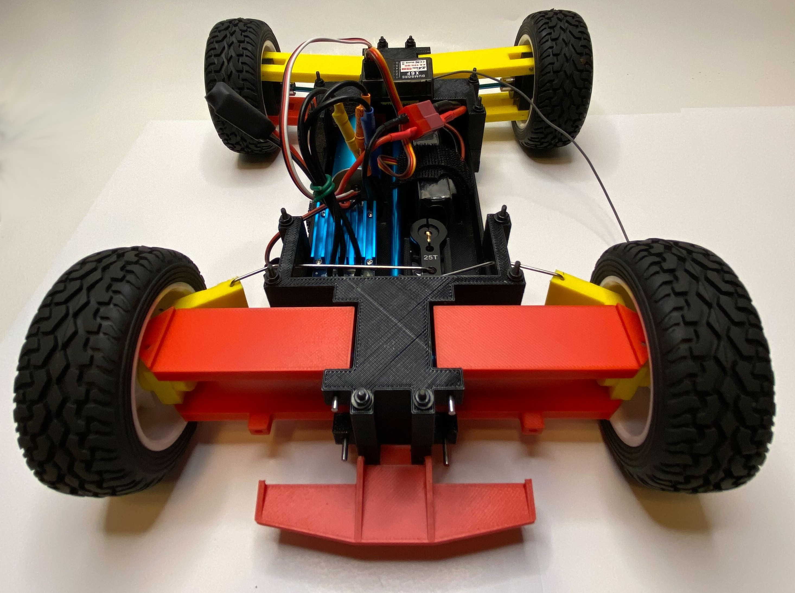
 

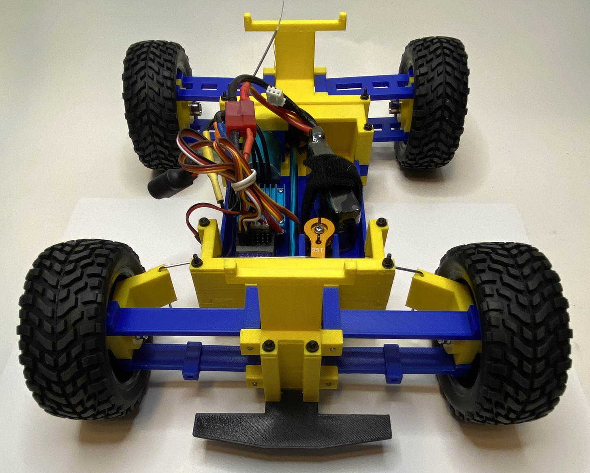
 

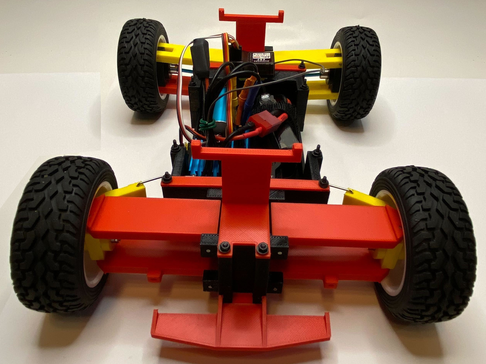
 
